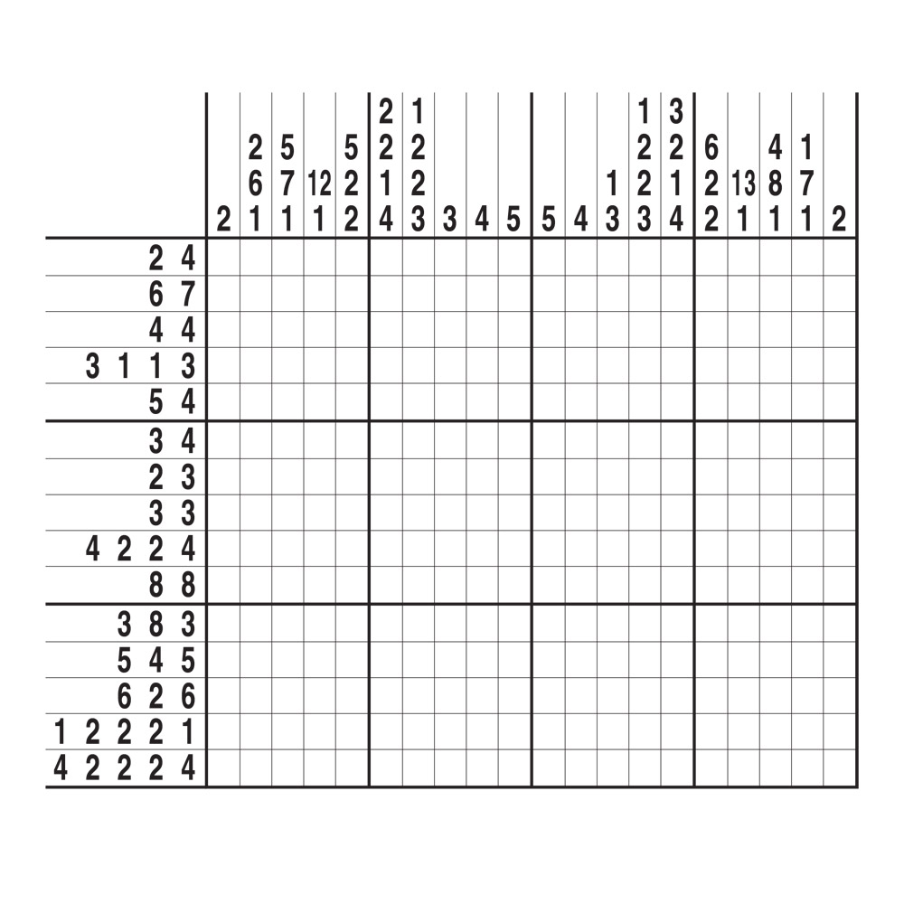

# Nonogram solver

### What's Nonogram?

Nonograms, also known as Picross, Griddlers, or Japanese crosswords, are logic puzzles in which cells in a grid must be colored or left blank according to numbers given at the side of the grid. These numbers indicate how many unbroken lines of filled-in squares there are in any given row or column. When completed correctly, the puzzle reveals a hidden picture.

Example:
For instance, a clue 3 1 for a row means:

```
There are 3 consecutive filled cells,
Followed by at least one blank cell,
Then 1 filled cell.
```


Nonograms require deductive reasoning and pattern recognition to solve and can vary in complexity from small 5×5 grids to large, intricate puzzles.


Here is an example of nonogram crossword:



### About repo

This repository contains a Multisize Nonogram Solver, a tool designed to automatically solve nonogram puzzles using algorithmic techniques.

### Usage

```bash
git clone https://github.com/yourusername/nonogram-solver.git
cd nonogram-solver
```

After clonning, you should open main.py file and put your crossword clues according to this signature as argument of solve(clues...):

```python
clues = (tuple((column_clues,) for column_clues in column),
         tuple((row_clues,) for row_clues in row))
```

Then run the file:

```bash
python main.py
```